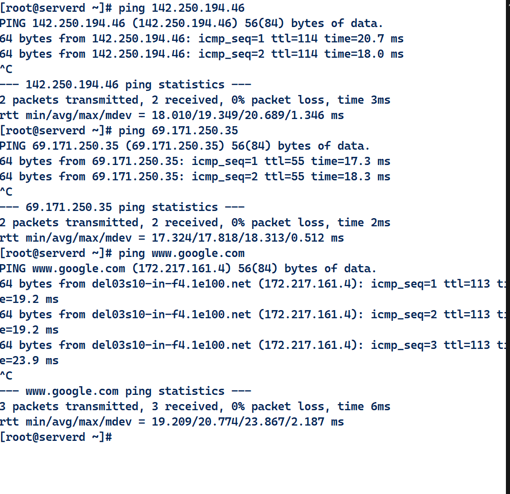

- 🔰 Create a Setup so that you can ping google  but not able to ping Facebook from same system

Commands used:

- route 
- ping
- nslookup
- ip

## Before deleting the default route:

## AFTER DELETING DEFAULT ROUTE AND ADDED THE ROUTE FOR GOOGLE ONLY.

